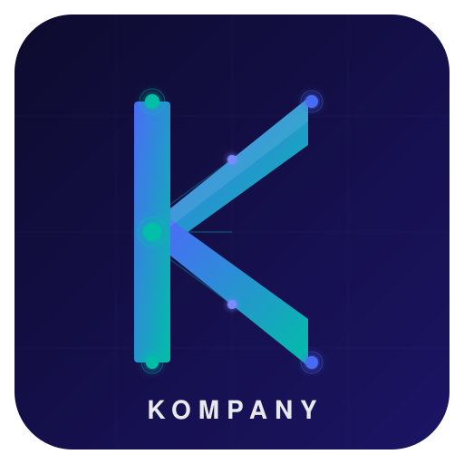

<p align="center">
  
</p>

<p align="center">
  <strong>Kompany</strong><br>
  Autonomous Business Operating System for Solo Founders
</p>

<p align="center">
  <a href="https://github.com/Fei2-Labs/Kompany/stargazers"></a>
  <a href="https://github.com/Fei2-Labs/Kompany/network/members"></a>
  <a href="https://github.com/Fei2-Labs/Kompany/issues"></a>
  <a href="https://github.com/Fei2-Labs/Kompany/blob/main/LICENSE"></a>
  <a href="https://www.python.org/downloads/"></a>
</p>

<p align="center">
  <a href="https://buymeacoffee.com/clarezoe"></a>
</p>

---

Give Kompany a directive and a budget. The CEO agent conducts the team, delegates tasks, creates revenue projects when funds are short, and **never downgrades your mission**. Every AI cost is tracked as a real business expense. Works standalone via CLI, REST API, MCP, or SDK.

> **Open-core.** This repo is the whole engine under Apache-2.0 — no
> crippled "community edition." Commercial extensions (curated playbooks,
> specialist agent souls, business integrations) live in a separate
> proprietary package, `kompany-pro`. Details:
> [Open Core — Core / Pro / Cloud](#open-core--core--pro--cloud).

## Why This Exists

Solo founders make high-stakes decisions daily across product, engineering, finance, marketing, sales, and operations — often without anyone to challenge their thinking. Single-agent AI tools answer questions in isolation. They don't debate, push back, or synthesize cross-functional perspectives.

Kompany gives you an autonomous C-suite that **operates** — classifying directives, checking budgets, running multi-agent debates, creating revenue projects, and executing tasks — all while tracking every cent of AI cost as a real business expense.

## Core Principles

1. **Mission Integrity** — The CEO never downgrades the Master's mission. Budget insufficient? Create a revenue project to earn the funds. "We can't afford it" is not an answer. "Here's how we'll fund it" is.
2. **AI Costs Are Real Costs** — Every LLM call is an operational expense tracked in the company ledger. The balance can go negative. This increases the revenue target, never cancels the mission.
3. **Goal Persistence** — A negative balance doesn't cancel anything. If the company is -€2 after running agents and needs €4,450 for a Mac Studio, the revenue project target is €4,452.

## How It Works

```
Master: "Buy a Mac Studio M4 128GB, budget €50"
  │
  ▼
KompanyEngine.process_directive(raw_input)
  │
  ├─ 1. CEO classifies → ACQUISITION, ~€4500, squad: strategy
  │     (AI cost: ~$0.03 → ledger)
  │
  ├─ 2. CFO.check_budget(4500) → balance: €49.97, shortfall: €4450.03
  │     (mechanical, no LLM cost)
  │
  ├─ 3. MISSION INTEGRITY: CEO creates revenue project
  │     CEO consults CRO+CMO+CTO for revenue paths
  │     (AI cost: ~$0.15 → ledger, balance now ~€49.82)
  │     Revenue target = €4500 - €49.82 = €4450.18
  │     Creates Project with paths + auto-trigger on funded
  │
  └─ 4. Report to Master with plan + running cost summary
```

## The Executive Team

| Agent | Role | Type | Optimizes For |
|---|---|---|---|
| **CEO** | Final decision-maker & conductor | LLM (Opus) | Vision, strategy, mission integrity |
| **CFO** | Financial gatekeeper & cost visibility | LLM (Sonnet) | Budget checks, balance tracking, financial monitoring |
| **CTO** | Technology leadership | LLM (Sonnet) | Technical correctness, scalability |
| **CPO** | Product leadership | LLM (Sonnet) | User value, time-to-market, PMF |
| **CMO** | Marketing leadership | LLM (Sonnet) | Brand equity, top-of-funnel growth |
| **CRO** | Revenue leadership | LLM (Sonnet) | Pipeline, deal velocity, ARR |
| **COO** | Operations leadership | LLM (Sonnet) | Execution capacity, process reliability |
| **CSA** | Solution architecture | LLM (Sonnet) | Architectural integrity, integrations |
| **CISO** | Security & compliance | LLM (Sonnet) | Risk mitigation, compliance posture |
| **CoS** | Debate moderator & synthesizer | LLM (Sonnet) | Neutral facilitation, structured briefs |
| **CV** | Brand visuals & visual direction | LLM (Sonnet) | Visual consistency, brand identity |

### Execution Subagents

| Agent | Role |
|---|---|
| **Analyst** | Financial modeling & ROI analysis |
| **Builder** | Code & product creation |
| **Procurement** | Vendor research & negotiation |
| **Researcher** | Market research & data gathering |
| **Writer** | Content creation & copywriting |

### Communication

All agents communicate through direct function calls via `KompanyEngine`. CoS coordinates cross-functional issues and helps CEO make final calls. See `docs/context/core-architecture.md` for details.

---

## Table of Contents

- [Installation](#installation)
- [Quick Start](#quick-start)
- [Usage Guide](#usage-guide)
  - [CLI Reference](#cli-reference)
  - [REST API](#rest-api)
  - [MCP Server](#mcp-server)
  - [Python SDK](#python-sdk)
  - [Claude Code Skill](#claude-code-skill)
- [Directive Types](#directive-types)
- [Autonomy Tiers](#autonomy-tiers)
- [Multi-Agent Debates](#multi-agent-debates)
- [Stage Profiles](#stage-profiles)
- [Multi-Provider LLM Support](#multi-provider-llm-support)
- [Project Structure](#project-structure)
- [Configuration](#configuration)
- [Running Tests](#running-tests)
- [Open Core — Core / Pro / Cloud](#open-core--core--pro--cloud)
- [Contributing](#contributing)
- [Support](#support)
- [License](#license)

---

## Quick Start (Desktop App)

The fastest way to try Kompany is the desktop bundle. Double-click,
fill out the in-window onboarding form, and you're live — no Python
install, no terminal, no browser.

| Platform | Download                          | First-launch                               |
|----------|-----------------------------------|--------------------------------------------|
| macOS    | `Kompany.dmg` (drag to Applications) | Right-click the app icon → **Open** the first time (v1 ships unsigned). |
| Windows  | `Kompany.msi`                     | SmartScreen → **More info** → **Run anyway**. |
| Linux    | `Kompany.AppImage`                | `chmod +x Kompany.AppImage && ./Kompany.AppImage` |

> Releases are not yet published to GitHub Releases. To build the
> installer locally, run `./kompany/build_desktop.sh` from a checkout.
> See [`docs/context/distribution.md`](docs/context/distribution.md) for
> the toolchain prerequisites.

On first launch a cyberpunk onboarding wizard walks you through six
steps in the same window:

1. **Connection** — pick a provider, paste your API key (custom
   OpenAI-compatible endpoints supported; auto-filled from env / a
   data-dir `.env` when present). The key is verified by a live ping
   and stashed to the encrypted vault immediately, so quitting
   mid-flow never loses it.
2. **Faction** — choose a starter company template.
3. **Mission** — set your starting budget, revenue target, optional
   customer-count goal, and a deadline.
4. **Team review** — your AI C-suite debates whether the targets are
   feasible and proposes adjusted numbers. You can keep yours, adopt
   theirs, or counter-propose (re-runs only when you actually change a
   number).
5. **First move** — the team proposes three concrete first-week
   directives with day-by-day plans; pick one or ask the team
   questions. Don't like them? Regenerate.
6. **Provisioning** — the dashboard pivots in once the picked
   directive is activated and the team starts executing it.

Time in Kompany is **virtual**: one completed task = one virtual day,
so a paused app doesn't burn runway and a fast-working team isn't
penalised by the wall clock. The header's `days: N/M vd` tracks
virtual days against your deadline budget.

## Installation

### One-line install (recommended)

```bash
uvx kompany onboard --yes
```

That single command checks your environment, captures your LLM API key
(masked, stored in the encrypted vault), applies a starter company
template, and prints the first set of "what to do next" hints — all in
under 90 seconds. Pass `--provider=...`, `--api-key=...`,
`--template=...`, `--directive="..."`, or `--data-dir=/path` to skip
specific prompts; with all of them plus `--yes`, the wizard runs fully
headless. See [`docs/context/onboarding.md`](docs/context/onboarding.md)
for the full step-by-step.

### Prerequisites

- Python 3.11+
- An API key for at least one supported LLM provider (see [Multi-Provider LLM Support](#multi-provider-llm-support))

### Install from Source

```bash
git clone https://github.com/Fei2-Labs/Kompany.git
cd Kompany/kompany

# Create and activate virtual environment
python3 -m venv .venv
source .venv/bin/activate   # macOS/Linux
# .venv\Scripts\activate    # Windows

# Install the package
pip install -e .

# For REST API support
pip install -e ".[api]"

# For MCP server support
pip install -e ".[mcp]"

# For development (tests)
pip install -e ".[dev]"

# Or install everything
pip install -e ".[api,mcp,dev]"
```

### Set Your API Key

```bash
export ANTHROPIC_API_KEY=your-key-here
```

Or create a `.env` file in the `kompany/` directory:

```
ANTHROPIC_API_KEY=your-key-here
```

To use other providers, set their API keys too (see [Multi-Provider LLM Support](#multi-provider-llm-support)).

For the encrypted credential vault, Kompany resolves a master key in this order: `KOMPANY_VAULT_KEY` env var → a file at `<data_dir>/.vault-master.key` (auto-generated, `chmod 0600`) → OS keychain (legacy) → freshly generated. The file-based default avoids repeated keychain prompts on unsigned desktop builds. Your provider API keys are then stored encrypted (Fernet) in the `credential_vault` table under that master key — never in plaintext on disk.

### Verify Installation

```bash
kompany --help
```

You should see the list of available commands.

---

## Quick Start

### 1. Initialize Your Company

```bash
kompany init --name "Acme SaaS" --product "AI invoice reconciliation" --balance 50 --stage solo
```

This creates the SQLite database, sets your starting balance to €50, and configures the company at the `solo` stage.

### 2. Send Your First Directive

```bash
kompany directive "Buy a Mac Studio M4 128GB, budget €50"
```

The CEO will classify this as an ACQUISITION directive, check the budget, find the shortfall, and create a revenue project with concrete revenue paths to fund the purchase.

### 3. Check Status

```bash
kompany status
```

See your company name, balance, active projects, total income, expenses, and AI costs.

### 4. View Projects

```bash
kompany projects
```

Lists all active projects including revenue projects created to fund missions.

### 5. Run a Strategic Debate

```bash
kompany debate "Should we build SSO or focus on self-serve onboarding?"
```

Runs a multi-agent debate with structured rounds, CoS synthesis, and a CEO decision.

---

## Usage Guide

Kompany has four interfaces. All of them call the same `KompanyEngine` — same logic, same ledger, same results.

### CLI Reference

The CLI is built with [Typer](https://typer.tiangolo.com/) and [Rich](https://github.com/Textualize/rich) for formatted terminal output.

#### `kompany init`

Initialize a new company. You'll be prompted interactively for any values not passed as options.

```bash
kompany init --name "My Startup" --product "AI tools for devs" --balance 100 --stage solo
```

| Option | Description | Default |
|---|---|---|
| `--name` | Company name | *(prompted)* |
| `--product` | One-line product description | *(prompted)* |
| `--balance` | Starting balance in euros | *(prompted)* |
| `--stage` | Company stage: `solo`, `pre-seed`, `seed`, `series-a` | *(prompted)* |

#### `kompany directive`

Send a natural language directive. The CEO classifies it, routes it, and handles it autonomously.

```bash
kompany directive "Hire a freelance designer for the landing page, budget €500"
```

```bash
kompany directive "What's our current balance?"
```

```bash
kompany directive "Set up a CI/CD pipeline for the main repo"
```

| Argument | Description |
|---|---|
| `text` | The directive in natural language |

| Option | Description |
|---|---|
| `--config / -c` | Path to custom config file |

**What happens under the hood:**

1. CEO classifies the directive into one of four types (ACQUISITION, STRATEGIC, OPERATIONAL, INFORMATIONAL)
2. Routes to the appropriate handler
3. CFO checks budget if needed (mechanical — no LLM cost)
4. If budget is short, CEO creates a revenue project
5. AI costs are recorded in the ledger
6. Result is displayed with cost transparency

#### `kompany status`

Display the current company state.

```bash
kompany status
```

Output includes:
- Company name and product
- Current balance
- Total income, expenses, and AI costs
- Number of active projects

#### `kompany projects`

List all active projects.

```bash
kompany projects
```

Shows project ID, name, type (revenue/operational/strategic), status, target amount, and funded amount for each project.

#### `kompany project`

Show details for a specific project, including its tasks and revenue paths.

```bash
kompany project abc12345
```

| Argument | Description |
|---|---|
| `project_id` | The project ID (shown in `kompany projects` output) |

#### `kompany debate`

Run a full multi-agent debate on a strategic question.

```bash
kompany debate "Should we raise a Series A or extend runway through revenue?"
```

The debate follows a structured protocol:
1. **Round 1** — Independent positions (each agent argues from their domain)
2. **Round 2** — Rebuttal & challenge (agents respond to each other)
3. **Round 3** — Convergence (move toward consensus, flag hard lines) — *only in 3-round mode*
4. **CoS Synthesis** — Structured CEO brief
5. **CEO Decision** — Final call with rationale and next steps

| Argument | Description |
|---|---|
| `question` | The strategic question to debate |

#### `kompany ledger`

Show recent financial transactions.

```bash
kompany ledger
kompany ledger --limit 25
```

| Option | Description | Default |
|---|---|---|
| `--limit / -n` | Number of entries to show | 10 |

Each entry shows: timestamp, amount, balance after, description, and category (income, expense, ai_cost, allocation, refund).

#### `kompany execute`

Execute a revenue project's tasks autonomously using subagents.

```bash
kompany execute abc12345
```

| Argument | Description |
|---|---|
| `project_id` | The project to execute |

This decomposes the project into tasks, assigns subagents (Analyst, Builder, Researcher, Writer, Procurement), and runs them. AI costs for each task are tracked in the ledger.

---

### REST API

Start the API server (requires `pip install -e ".[api]"`):

```bash
uvicorn kompany.interfaces.api:app --reload
```

The API runs at `http://localhost:8000`. Interactive docs at `http://localhost:8000/docs`.

#### Endpoints

| Method | Endpoint | Description |
|---|---|---|
| `POST` | `/init` | Initialize a new company |
| `POST` | `/directive` | Send a directive |
| `GET` | `/status` | Get company status |
| `GET` | `/projects` | List active projects |
| `GET` | `/projects/{project_id}` | Get a specific project |
| `GET` | `/ledger?limit=10` | Get recent ledger entries |
| `POST` | `/projects/{project_id}/execute` | Execute a project's tasks |

#### Examples

**Initialize:**
```bash
curl -X POST http://localhost:8000/init \
  -H "Content-Type: application/json" \
  -d '{"name": "Acme", "product": "AI tools", "balance": 50, "stage": "solo"}'
```

**Send a directive:**
```bash
curl -X POST http://localhost:8000/directive \
  -H "Content-Type: application/json" \
  -d '{"text": "Buy a Mac Studio M4 128GB, budget €50"}'
```

Response:
```json
{
  "status": "completed",
  "message": "Revenue project created to fund acquisition...",
  "project_id": "abc12345",
  "total_ai_cost": 0.18,
  "agents_used": ["CEO", "CFO", "CRO", "CMO", "CTO"]
}
```

**Check status:**
```bash
curl http://localhost:8000/status
```

**View ledger:**
```bash
curl "http://localhost:8000/ledger?limit=20"
```

---

### MCP Server

Run as an MCP server for Claude Code, Cursor, or any MCP-compatible client (requires `pip install -e ".[mcp]"`):

```bash
kompany-mcp
# or
python -m kompany.interfaces.mcp_server
```

#### Available Tools

| Tool | Parameters | Description |
|---|---|---|
| `kompany_init` | `name`\*, `product`\*, `balance` (default: 0.0), `stage` (default: "solo") | Initialize a new company |
| `kompany_directive` | `text`\* | Send a natural language directive |
| `kompany_status` | *(none)* | Get company status |
| `kompany_projects` | *(none)* | List active projects |
| `kompany_project` | `project_id`\* | Get project details |
| `kompany_ledger` | `limit` (default: 10) | Get recent ledger entries |
| `kompany_debate` | `question`\* | Run a multi-agent debate |
| `kompany_execute` | `project_id`\* | Execute a project's tasks |

#### Claude Code Configuration

Add to your Claude Code MCP settings:

```json
{
  "mcpServers": {
    "kompany": {
      "command": "kompany-mcp",
      "env": {
        "ANTHROPIC_API_KEY": "your-key-here"
      }
    }
  }
}
```

---

### Python SDK

Use Kompany programmatically in your own Python code:

```python
from kompany import Kompany

# Initialize
k = Kompany()
k.init(name="Acme", product="AI tools", balance=50, stage="solo")

# Send a directive
result = k.directive("Buy a Mac Studio M4 128GB, budget €50")
print(result["message"])
print(f"AI cost: ${result['total_ai_cost']:.2f}")

# Check balance
print(f"Balance: €{k.balance():.2f}")

# View status
status = k.status()
print(f"Active projects: {status['active_projects']}")

# List projects
for project in k.projects():
    print(f"  {project['id']}: {project['name']} ({project['status']})")

# Get project details
project = k.project("abc12345")
print(project["plan"])

# View ledger
for entry in k.ledger(limit=5):
    print(f"  {entry['description']}: {entry['amount']}")

# Execute a revenue project
result = k.execute_project("abc12345")
print(result)
```

#### SDK Methods

| Method | Returns | Description |
|---|---|---|
| `Kompany(config_path=None)` | — | Constructor. Optionally pass a config file path. |
| `init(name, product, balance=0.0, stage="solo")` | `None` | Initialize a new company |
| `directive(text)` | `dict` | Send a directive, get the result |
| `status()` | `dict` | Company status (balance, projects, costs) |
| `projects()` | `list[dict]` | All active projects |
| `project(project_id)` | `dict \| None` | A specific project, or None |
| `balance()` | `float` | Current balance |
| `ledger(limit=10)` | `list[dict]` | Recent ledger entries |
| `execute_project(project_id)` | `dict` | Execute a project autonomously |

---

### Claude Code Skill

Kompany ships as a Claude Code skill. Invoke it directly in any Claude Code session:

```
/kompany "Buy a Mac Studio M4 128GB, budget €50"
```

```
/kompany "What's our balance?"
```

```
/kompany "Should we build SSO or focus on self-serve onboarding?"
```

The skill file is at `.claude/skills/kompany/SKILL.md`. It activates the venv, ensures the engine is installed, and routes your directive through `kompany directive`.

---

## Directive Types

Every directive is classified by the CEO into one of four types:

| Type | Triggers | Behavior |
|---|---|---|
| **ACQUISITION** | "Buy X", "Get X", "Hire X" | Must deliver X. Budget shortfall → revenue project. Never downgrade. |
| **STRATEGIC** | "Should we X?", "What's our approach to Y?" | CEO analysis or full multi-agent debate. |
| **OPERATIONAL** | "Set up X", "Configure Y", "Deploy Z" | CEO breaks into action steps and delegates to squad. |
| **INFORMATIONAL** | "What's our balance?", "Status", "How many projects?" | Query state directly. No LLM cost — mechanical CFO responds. |

---

## Autonomy Tiers

| Tier | Max Spend | Examples | Approval |
|---|---|---|---|
| Auto-execute | €5 | Research, analysis, internal planning | None needed |
| CEO-approved | €50 | Small purchases, internal comms | CEO decides, Master informed |
| Master-approved | Unlimited | Large spend, legal, external-facing, irreversible | Must ask Master |

---

## Multi-Agent Debates

Strategic directives can trigger a full multi-agent debate:

```
Question → Round 1: Independent positions (each exec argues from their domain)
         → Round 2: Rebuttal & challenge (execs respond to each other)
         → Round 3: Convergence (move toward consensus, flag hard lines)
         → CoS Synthesis (structured CEO brief)
         → CEO Decision (final call with rationale + next steps)
```

The number of rounds and participating agents depends on the company stage.

---

## Stage Profiles

The framework adapts its agent roster and cost profile based on your company stage:

| Stage | Active Agents | Debate Rounds | Max Cost |
|---|---|---|---|
| Solo founder | CEO, CTO, CPO, CFO, CoS | 2 | ~$0.50 |
| Pre-seed | CEO, CTO, CPO, CoS, CV | 2 | ~$0.75 |
| Seed | CEO, CTO, CPO, CMO, CRO, CoS, CV | 3 | ~$1.50 |
| Series A | All 11 agents | 3 | ~$2.00 |

---

## Multi-Provider LLM Support

Kompany supports multiple LLM providers. Any model tier (apex/primary/economy) can use any provider:

| Provider | Example Models | Connection |
|---|---|---|
| **Anthropic** | Claude Opus 4, Sonnet 4, Haiku 4 | Native `anthropic` SDK |
| **OpenAI** | GPT-4o, GPT-4.1, o3, o4-mini | `openai` SDK |
| **Google Gemini** | Gemini 2.5 Pro, 2.5/2.0 Flash | `openai` SDK (compatible endpoint) |
| **GLM (Zhipu AI)** | GLM-4 Plus, Air, Flash | `openai` SDK (compatible endpoint) |
| **Kimi (Moonshot)** | Moonshot v1, Kimi | `openai` SDK (compatible endpoint) |
| **Custom** | Any OpenAI-compatible model | `openai` SDK (your base URL) |

Provider routing: if `CUSTOM_LLM_BASE_URL` is set, **all** model tiers route to that custom OpenAI-compatible endpoint (it wins regardless of model-name prefix — so `gpt-5.5` or any model name your endpoint exposes works). Otherwise detection falls back to the model-name prefix (`claude-` → Anthropic, `gpt-`/`o3`/`o4` → OpenAI, `gemini-` → Gemini, etc.).

### Example: Use GPT-4o as primary

```bash
export ANTHROPIC_API_KEY="sk-ant-..."
export OPENAI_API_KEY="sk-..."
```

```yaml
models:
  apex: "claude-opus-4-20250514"
  primary: "gpt-4o"
  economy: "gemini-2.0-flash"
```

### Example: Use a custom OpenAI-compatible endpoint (e.g. a gateway)

```bash
export CUSTOM_LLM_BASE_URL="https://your-gateway.example.com/v1/"
export CUSTOM_LLM_API_KEY="sk-..."
# Point all three tiers at a model your endpoint serves:
export KOMPANY_MODEL_APEX="gpt-5.5"
export KOMPANY_MODEL_PRIMARY="gpt-5.5"
export KOMPANY_MODEL_ECONOMY="gpt-5.5"
```

In the desktop app you don't need env vars: pick **custom (OpenAI-compatible)** on the connection step, paste the base URL + key, and the wizard discovers available models from the endpoint's `/models` index. If those env vars (or a `.env` in the data dir) are present, the connection step auto-fills them.

Cost tracking works across all providers — each model has pricing data for accurate ledger entries.

---

## Project Structure

```
kompany/
├── src/kompany/
│   ├── __init__.py               # Package entry
│   ├── __main__.py               # python -m kompany support
│   ├── config/
│   │   └── settings.py           # Pydantic Settings (env vars + YAML)
│   ├── core/
│   │   ├── engine.py             # KompanyEngine — single entry point
│   │   ├── directive.py          # Directive model & classification enums
│   │   ├── debate.py             # Multi-agent debate engine
│   │   ├── debate_models.py      # Debate protocol schemas
│   │   ├── autonomy.py           # Autonomy gate (approval logic)
│   │   └── runner.py             # Project execution engine
│   ├── llm/
│   │   ├── client.py             # Multi-provider LLM client + cost tracking
│   │   ├── providers.py          # Provider enum, base URLs, auto-detection
│   │   ├── cost_tracker.py       # Per-call cost accounting
│   │   └── models.py             # Model pricing & tier config
│   ├── agents/
│   │   ├── base.py               # BaseAgent abstract class
│   │   ├── registry.py           # Agent factory & stage-based filtering
│   │   ├── ceo.py … cv.py        # 11 C-suite agents
│   │   ├── souls/                # Personality YAML files
│   │   └── subagents/            # 5 execution subagents
│   ├── state/
│   │   ├── database.py           # SQLite connection + schema
│   │   ├── ledger.py             # Financial transactions
│   │   ├── projects.py           # Project CRUD
│   │   ├── memory.py             # Agent per-session learning
│   │   ├── journal.py            # Decision log
│   │   └── models.py             # Pydantic state models
│   └── interfaces/
│       ├── cli.py                # Typer CLI (8 commands)
│       ├── api.py                # FastAPI REST API (onboarding, status, debate, projects, targets, ...)
│       ├── mcp_server.py         # MCP Server (8 tools)
│       └── sdk.py                # Python SDK
├── tests/                        # 850+ tests
├── pyproject.toml                # Package definition
└── README.md
```

---

## Configuration

### Environment Variables

| Variable | Description | Required |
|---|---|---|
| `ANTHROPIC_API_KEY` | Anthropic API key | Yes (if using Claude models) |
| `OPENAI_API_KEY` | OpenAI API key | No |
| `GEMINI_API_KEY` | Google Gemini API key | No |
| `GLM_API_KEY` | Zhipu AI (GLM) API key | No |
| `KIMI_API_KEY` | Moonshot (Kimi) API key | No |
| `CUSTOM_LLM_API_KEY` | Custom endpoint API key | No |
| `CUSTOM_LLM_BASE_URL` | Custom OpenAI-compatible base URL (when set, all tiers route here) | No |
| `KOMPANY_MODEL_APEX` / `_PRIMARY` / `_ECONOMY` | Override the three model tiers (use the same value for all three with a custom endpoint) | No |
| `KOMPANY_VAULT_KEY` | Fernet master key for the credential vault (else a `.vault-master.key` file is auto-generated in the data dir) | No |
| `KOMPANY_DATA_DIR` | Data directory (DB, vault, `.env`) | No (defaults to `~/.kompany`; the desktop app uses its platform app-support dir) |
| `KOMPANY_DB_PATH` | SQLite database path | No (defaults to `./kompany.db`) |
| `KOMPANY_CONFIG_PATH` | YAML config file path | No |

Unknown env vars are ignored (not an error), so your shell or `.env`
can carry unrelated keys without breaking engine startup. The desktop
app — launched from Finder/Explorer — doesn't inherit your shell
environment, so for it, place a `.env` in the data directory
(`<data_dir>/.env`).

### Company Config (YAML)

```yaml
company:
  name: "Your Company"
  product: "One-line product description"
  stage: "solo"          # solo | pre-seed | seed | series-a

# Override model tiers (optional)
models:
  apex: "claude-opus-4-20250514"     # or "gpt-4o", "gemini-2.5-pro", etc.
  primary: "claude-sonnet-4-20250514"
  economy: "claude-haiku-4-20250414"

# Custom OpenAI-compatible endpoint (optional)
custom_llm:
  base_url: "https://my-endpoint.example.com/v1"
  api_key: "my-key"
```

---

## Running Tests

```bash
cd kompany
source .venv/bin/activate
pip install -e ".[dev]"
python -m pytest tests/ -v
```

All 850+ tests should pass.

---

## AI Cost Transparency

Every LLM call is a real expense. The engine tracks per-call cost and records it in the ledger:

```
AI cost for this directive: $0.18
  CEO classify:      $0.03
  CEO revenue plan:  $0.15
Balance before: €50.00 → Balance after: €49.82
```

Use `kompany ledger` to see all transactions including AI costs.

---

## Open Core — Core / Pro / Cloud

Kompany follows an open-core model. The engine you see in this repo is
the whole engine — there is no crippled "community edition." Commercial
extensions live in a separate package.

| Tier | What's in it | License | Where |
|---|---|---|---|
| **Kompany Core** *(this repo)* | Full agent engine, debate runtime, cost ledger, budget tracking, CLI, REST API, MCP server, plugin contract (5 stable ABCs), 11 base C-suite + 5 subagent souls, 7 starter templates, 3 reference workflows (`idea-validation`, `weekly-exec-review`, `landing-page-launch`) | **Apache-2.0** — modify, redistribute, sell, fork, all fine | [`Fei2-Labs/Kompany`](https://github.com/Fei2-Labs/Kompany) |
| **Kompany Pro** | Curated deep playbooks above the 7 Core seeds, specialist agent souls (industry-specific roles like SaaS Compliance Officer / Ecom Inventory Manager — additive over Core's 11+5, never replacement), business integrations (Stripe, Polar, Notion, Slack, …) | Proprietary | `Fei2-Labs/kompany-pro` (private repo, access via subscription or Early Backer grant) |
| **Kompany Cloud** | Hosted SaaS — managed runtime, dashboard, scheduling, persistence, integrations | TBD pricing | Not yet launched |

**Pro is additive, never replacement.** Every Core artifact — the 11
C-suite souls, the 7 template seeds, the 3 reference workflows — is
permanent and fully functional. Pro adds net-new categories above them.
If a Core artifact has a bug, it's fixed in Core, not crowbar-replaced
by a Pro module.

**Pro contents are public; Pro code is gated.** The list of Pro modules
(workflow names, soul names, integration names) is published. Only the
source code stays behind authorization.

**How Pro plugs in.** Pro packages register contributions via Python
entry points defined by Core's plugin contract
(`kompany.plugins.contract`, v1.0.0). Discovery happens at engine init:

```bash
pip install kompany kompany-pro     # Pro from authorized index
python -c "from kompany.plugins.loader import discover; print(discover())"
```

Pro plugins appear alongside Core ones in the Templates picker, agent
registry, and workflow registry with no special-casing at call sites.
Version compatibility is enforced by pip dep pinning: a Core contract
major bump (`kompany 0.x → 0.y`) blocks `pip install -U kompany` until
a compatible Pro release ships. Intentional design — see
[ADR-0002](docs/adr/0002-plugin-contract-design.md).

**Early Backer grant.** Anyone who paid the Kompany 299 CNY presale
before the public OSS launch was automatically promoted to the
Kompany Early Backer tier — Core source (Apache-2.0, same as everyone)
plus 12 months of Pro source access, Cloud credit when Cloud ships,
private Discord, and one roadmap-input call. Full terms:
[`docs/early-backer-grant.md`](docs/early-backer-grant.md).

**Why this model.** The agent runtime is forkable in a week — gating it
would be performative. Real moat lives in curated workflows + Cloud
ops, which are content + operational, not gated by code obfuscation.
Decision context:
[`docs/context/open-core-model.md`](docs/context/open-core-model.md) +
[ADR-0001](docs/adr/0001-open-core-with-plugin-contract.md).

---

## Contributing

See [CONTRIBUTING.md](CONTRIBUTING.md) for guidelines.

1. Fork the repository
2. Create a feature branch: `git checkout -b feature/your-feature`
3. Make your changes
4. Run tests: `python -m pytest tests/ -v`
5. Commit with a clear message
6. Push and open a PR against `main`

---

## Support

If you find Kompany useful, consider supporting the project:

<a href="https://buymeacoffee.com/clarezoe"></a>

---

## License

Apache 2.0 — see [LICENSE](LICENSE) for details.

---

## Star History

[](https://star-history.com/#Fei2-Labs/Kompany&Date)
