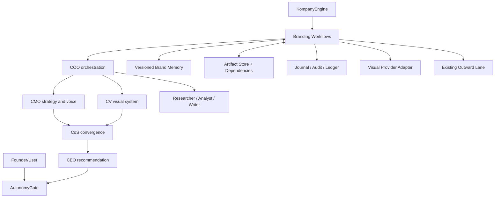

# Branding Department
- Status: implemented 2026-09-04 (all four workflows + generation tool + guidelines) — see §19–21 for as-built notes and remaining deltas
- Scope: integrate brand strategy plus gated visual brand-system workflows
- Source repos (structure only; see `THIRD_PARTY_NOTICES.md` in kompany-pro):
  - `https://github.com/arnabbagxd/Brand-building-skills` (MIT)
  - `https://github.com/amirmushichge/brand-system-skill` (CC BY 4.0)
## 1. Read before coding
Read `AGENTS.md`, `CONSTITUTION.md`, `CONTEXT.md`, relevant `docs/context/*`, the plugin contract, workflow runner, AutonomyGate, approval persistence, journal, audit, ledger, API, events, and board UI. Existing constitutional and Core decisions win over this document. Do not create parallel orchestration, approval, persistence, or publishing systems.
## 2. Decisions
1. Implement branding as a `kompany-branding` Workflow/Tool plugin, not as brand-specific Core code.
2. Do not add permanent Brand Strategist, Creative Director, or Brand Auditor roles.
3. Reuse existing roles: CMO owns strategy/verbal identity; CV owns visual identity/Brand Lock; CEO decides internally; COO orchestrates; founder/user is final authority through AutonomyGate.
4. Skills are bounded procedures, Agents are roles, Workflows own sequencing, Tools perform actions, Providers are replaceable adapters.
5. Brand Memory is structured, versioned project state, not chat history or one Markdown file.
6. Approved versions are immutable. Changes create successor drafts.
7. All credit-consuming generation requires an approved Generation Plan and cost envelope.
8. External publishing must use the existing outward-action lane.
## 3. Architecture

## 4. Role ownership
| Area | Owner | Support |
|---|---|---|
| Brief, audience, positioning, naming | CMO | Researcher, Analyst, CPO, CRO |
| Story, voice, messaging | CMO | Writer |
| Visual identity brief | CMO | CV |
| Reference deconstruction, creative direction | CV | CMO, CISO |
| Anchor Brand Kit, Brand Lock, visual guidelines | CV | CMO, CISO |
| Final internal direction | CEO | CoS |
| Workflow execution | COO | execution agents |
| Cost review | CFO | COO |
| Claims, rights, publication safety | CISO | CMO, CV |
| Final authorization | Founder/user | AutonomyGate |
CMO's `brand-identity` capability stops at an actionable visual brief. CV owns actual visual-system decisions and generation.
## 5. Plugin layout
```text
packages/kompany-branding/
  pyproject.toml
  THIRD_PARTY_NOTICES.md
  licenses/
  src/kompany_branding/
    models/          # brief, strategy, verbal identity, Brand Lock, refs, audits
    services/        # repository, projections, guards, invalidation, provenance
    skills/
      strategy/      # context, audience, competitors, positioning, naming, voice
      creative/      # reference analysis, direction, anchor kit, Brand Lock
      audit/          # strategy, visual, reference independence, publication
    workflows/       # brand-foundation, brand-system, brand-campaign, brand-audit
    workflow_steps/  # persistence, approvals, generation, audit, invalidation
    tools/           # ref register, image generate, asset register, font verify
    providers/       # replaceable visual-generation and font-catalog adapters
  tests/
```
Register workflows and tools through existing Python entry points. Do not register new AgentSouls in v1.
## 6. Source skill mapping
| Internal capability | Source inspiration | Kompany owner |
|---|---|---|
| context, audience, competitors, positioning, naming | Brand-building-skills | CMO |
| story, voice, messaging, visual brief | Brand-building-skills | CMO |
| reference deconstruction, creative direction | brand-system-skill | CV |
| Anchor Brand Kit, Brand Lock, campaign system | brand-system-skill | CV |
| strategy audit | Brand-building-skills | CMO |
| visual/reference audit | brand-system-skill | CV + CISO |
Verify current licenses and source commit SHAs before adapting. Preserve MIT notice for the first repo and CC BY 4.0 attribution for the second. Record modifications in `THIRD_PARTY_NOTICES.md`.
## 7. Workflows
### `brand-foundation`
`brief -> evidence research -> audience/competitor analysis -> positioning -> optional naming -> story/voice/messaging -> CISO review -> CoS synthesis -> CEO recommendation -> founder approval -> immutable strategy snapshot`
Output: approved `BrandStrategy`, `VerbalIdentity`, `VisualIdentityBrief`, evidence, assumptions, risks, decision journal entry.
### `brand-system`
Requires approved foundation.
`register reference/rights -> CV deconstruction -> creative direction -> CEO/founder gate -> Generation Plan -> cost approval -> provider generation -> artifact registration -> CV audit -> refine or reject/restart -> Anchor Kit approval -> Brand Lock -> guidelines`
A rejected direction is quarantined and must never be reused as a visual reference.
### `brand-campaign`
Requires approved strategy and Brand Lock.
`CMO campaign brief -> CV visual plan -> CISO claims/rights -> generation approval -> generation -> CV visual audit -> CMO message review -> CISO publication review -> existing outward lane`
### `brand-audit`
Read-only by default. Score strategy alignment, voice, messaging, Brand Lock compliance, reference independence, claims, and stale dependencies.
## 8. State
Keep workflow stage separate from resource status.
```python
class BrandStage(str, Enum):
    INTAKE = "intake"
    FOUNDATION_DRAFT = "foundation_draft"
    FOUNDATION_PENDING_APPROVAL = "foundation_pending_approval"
    FOUNDATION_APPROVED = "foundation_approved"
    CREATIVE_DIRECTION_DRAFT = "creative_direction_draft"
    CREATIVE_DIRECTION_PENDING_APPROVAL = "creative_direction_pending_approval"
    ANCHOR_KIT_DRAFT = "anchor_kit_draft"
    ANCHOR_KIT_PENDING_APPROVAL = "anchor_kit_pending_approval"
    BRAND_LOCKED = "brand_locked"
    PRODUCTION = "production"
    AUDIT = "audit"
    COMPLETE = "complete"
    BLOCKED = "blocked"
class VersionStatus(str, Enum):
    DRAFT = "draft"
    PROPOSED = "proposed"
    APPROVED = "approved"
    REJECTED = "rejected"
    SUPERSEDED = "superseded"
    STALE = "stale"
```
Only engine services transition state. Approved rows are append-only. Revision creates a successor linked to the original approval/predecessor.
## 9. Generic Core persistence
First inspect for equivalent services. If absent, add domain-neutral stores:
- `ProjectDocumentStore`: scoped by company/project/namespace/key/version; draft, propose, approve, reject, supersede, retrieve.
- `ArtifactStore`: URI, MIME, checksum, metadata, run/approval IDs, source versions, dependencies, stale status.
- `artifact_dependencies`: artifact -> document version -> JSON path.
Do not add `BrandMemory` tables to Core. Branding uses namespaces such as `branding.strategy`, `branding.verbal_identity`, `branding.visual_brief`, `branding.creative_direction`, and `branding.brand_lock`.
If plugins cannot access scoped stores, extend `ToolContext` additively with optional `company_id`, `project_id`, `documents`, and `artifacts`; bump the plugin-contract minor version and add compatibility tests.
## 10. Brand Memory and Brand Lock
Minimum approved Brand Memory:
```text
brief
strategy: audience, problem, category, positioning, differentiation, proof
verbal_identity: story, voice rules, vocabulary, messaging hierarchy
visual_brief: intended impression, logo/color/type/imagery intent, avoid list
references: source, role, rights status, allowed influence, prohibited copying
brand_lock: logo, colors, typography, imagery, graphic language, packaging rules
```
Brand Lock must be machine-readable and versioned. It records exact font family names, color tokens and roles, logo rules, composition, whitespace, imagery, materials, hierarchy, prohibited styles, approved internal anchors, and approval IDs. Every visual asset records the exact Brand Lock version used.
## 11. Approval integration
Reuse `ApprovalRequests`; do not create `brand_approvals`.
Brand gates: `brand_foundation`, `creative_direction`, `anchor_brand_kit`, `generation_plan`, `brand_lock_change`, `publication`.
Payload includes brand/project/run IDs, proposal version, preview artifacts, recommendation, alternatives, risks, estimated cost, and downstream invalidation impact.
Map existing states normally: approved executes an idempotent effect; rejected stops downstream work; revision creates a successor draft; snoozed preserves checkpoint; cancelled stops cleanly.
## 12. Generation and providers
`branding.asset.generate` declares `SideEffect.SPEND` and `AutonomyTier.APPROVAL`.
Generation Plan must contain objective, deliverables, provider/model, inputs, reference IDs and roles, locked decisions, flexible elements, exact fonts, prohibited elements, output count/formats, estimated cost, and confidence.
Provider interface is replaceable (`Lovart`, OpenAI image generation, Canva, etc.). Domain models must not contain provider-specific fields. Record provider request ID, model, prompt hash, safe prompt audit record, seed when available, actual cost, dimensions, MIME type, safety result, and source references.
## 13. Reference and IP rules
Each external reference receives one primary role: scene, composition, lighting, material, packaging structure, product truth, or approved internal anchor.
Extract design logic; do not copy identity. Prohibit one-to-one recreation, near duplicates, exact characters/poses/object arrangement, proprietary marks, and simple rebranding of another artwork. External scene references never override Brand Lock. Unknown rights remain unknown. CISO blocks publication readiness when required evidence is missing.
## 14. Dependency invalidation
Artifacts declare JSON-path dependencies. On approval of a successor brand version: diff changed paths, find affected artifacts, mark them stale, emit an event, and show impact before approval. Do not delete or auto-regenerate them.
Examples: positioning changes invalidate direction/Brand Lock/campaigns; name changes invalidate logo/packaging; voice changes invalidate copy; color/type/imagery changes invalidate only dependent visual assets.
## 15. Precision context
Implement stage-specific projections. Foundation gets facts/evidence/gaps. Visual work gets only approved strategy, visual brief, claims, references, constraints, and approved assets. Campaigns get only current Brand Lock, relevant messaging, product facts, and channel brief. Audits get target asset plus exact dependency versions. Never inject rejected assets as positive examples or let draft state override approved state.
## 16. Implementation order
1. Inspect current stores, workflow runner, run context, approvals, events, API, and UI; write a gap list in the active plan.
2. Add missing generic document/artifact persistence, migrations, and tests.
3. Scaffold `kompany-branding`, entry points, schemas, notices, projections, and guards.
4. Implement the first vertical slice only: `brief -> CMO proposal -> CEO recommendation -> founder approval in existing board -> immutable snapshot -> journal/audit`.
5. Add approve, reject, revision, snooze/resume, and idempotent-effect tests.
6. Then implement visual workflow, provider adapter, Brand Lock, audit, and invalidation.
7. Add campaign/guideline workflow last; publishing remains in the outward lane.
8. Run the full test suite after each slice. Keep Python files within the repo size rule.
## 17. Done criteria
- Installed through plugin contract; no unnecessary permanent roles.
- CMO/CV/CEO/COO/founder boundaries are enforced.
- Brand Memory and Brand Lock are structured, versioned, and immutable by approved version.
- No generation occurs before exact plan/cost approval.
- Assets contain provenance, cost, source references, and brand versions.
- Rejected directions are quarantined; upstream changes mark dependencies stale.
- Existing approvals, board, journal, audit, ledger, checkpoints, and outward lane are reused.
- Provider is replaceable; licenses and attribution are complete.
- Contract changes have an ADR and compatibility tests.
- Full repository tests pass; finalized context doc is linked from `CONTEXT.md`.
## 18. First task now
Start with the repository fit check and the `brand-foundation` vertical slice. Do not implement image generation in the first change set. Report changed files, architectural fit, tests run, remaining gaps, and the next slice. Do not push unless explicitly instructed.

## 19. Repository fit (as built, 2026-09-04)
Core stayed generic; the department is a plugin. Tier follows `AGENTS.md` (curated workflow libraries → Pro), so `packages/kompany-branding/` from §5 became `kompany_pro/branding/` in the private kompany-pro repo with the same internal layout (models, namespaces, projections, gates, workflows). Moving it is a founder tier decision, not a code change.

| Handoff need | Where it landed |
|---|---|
| Generic persistence (§9) | Core `state/documents.py` (`ProjectDocumentStore`, statuses draft/proposed/approved/rejected/superseded/stale, approved rows immutable, successor via `predecessor_version`) and `state/artifacts.py` (`ArtifactStore`, `artifact_dependencies`, `changed_json_paths`). Tables `project_documents`, `artifacts`, `artifact_dependencies` via `_migrate()`. |
| Plugin access to stores (§9) | Contract **1.1.0** (additive): `ToolContext` gains optional `company_id`, `project_id`, `documents`, `artifacts`, `approvals`, `journal`, `events`; `ExecutorContext.tool_context` hands the same bundle to workflow `python_callable` steps; `Workflow.bind(engine)` boot hook. |
| Approval integration (§11) | Reuses `ApprovalRequests`. Core adds `engine.register_approval_effect(action_type, on_approve, on_reject)` (symmetric to `register_revision_handler`); the plugin registers `brand_foundation` effects from `bind`. Approve/reject effects stamp `effect_applied` (idempotent); revise creates successor drafts + a linked card; snooze/cancel touch no documents. |
| Running workflows | Core `engine.run_workflow(id, inputs, project_id)` + `engine.workflows_list()`; surfaced on CLI `kompany workflows list|run`, REST `GET /workflows`, `POST /workflows/{id}/run`, MCP `kompany_workflows_list` / `kompany_workflow_run`, SDK `workflows_list()` / `run_workflow()`. |
| Brand Memory (§10) | Namespaces `branding.brief`, `branding.strategy`, `branding.verbal_identity`, `branding.visual_brief` (+ `branding.stage` as an append-only stage chain). Approving a `brand_foundation` card freezes the four proposed versions together and writes a `brand_foundation` decision journal entry. |
| Precision context (§15) | `kompany_pro/branding/projections.py`: the CMO sees approved memory + stage + founder revision hint + gaps; drafts and rejected versions are never injected. |
| Dependency invalidation (§14) | Impact is previewed on the card (`invalidation_impact`) before approval; on approval of a successor version, dependent artifacts on changed JSON paths are marked stale (never deleted / regenerated) and a `branding.artifacts_stale` event is published. |
| Board (§16.4) | No UI change: unknown `action_type`s already classify as `decision`; the card renders with approve / reject / revise / snooze / comment. |

## 20. Slice 2 as built (visual system)
| Handoff need | Where it landed (kompany-pro `kompany_pro/branding/`) |
|---|---|
| References + IP rules (§13) | `references.py`: one primary `ReferenceRole`, `RightsStatus` (unknown stays unknown), `PROHIBITED_COPYING`; stored as approved `branding.references` versions; `branding.quarantine` append-only list of rejected direction/artifact ids. Tool `branding.reference.register` (WRITE_LOCAL) or `references` input on `brand-system`. |
| `brand-system` (§7) | `workflows/brand_system.*`: requires approved foundation → registers references → CV deconstruction → CV creative direction → CISO rights review (blockers force `revise`) → CEO recommendation → `creative_direction` card. Reject = version rejected AND quarantined (its artifacts too); revise = successor + linked card. |
| Generation Plan + cost gate (§12) | `generation.py`: `GenerationPlan` is the input schema of tool `branding.asset.generate` (`SideEffect.SPEND`, `AutonomyTier.APPROVAL`), exposed by integration `branding-visual`. Filing it via `engine.propose_action` IS the `generation_plan` gate (existing `tool_action` money card with provider cost preview). Execute refuses without approved/non-quarantined direction or with prohibited-rights references; fails closed when no provider is connected (card stays re-approvable); books real spend as `tool_cost`. |
| Provider adapter (§12) | `providers/`: `VisualProvider` ABC + `GeneratedAsset` (provider-neutral provenance), `OpenAIImagesProvider` (`gpt-image-1`, price table, module-level transport for tests), `select_provider` fails closed, `fonts.py` font-catalog adapter (static open-font list; unknown → `unverified`, never silently accepted). |
| Artifact provenance | Each generated asset: file under `<data_dir>/branding/assets/<brand>/`, artifact `kind=branding.generated` with provider, model, request id, seed, prompt hash, safe-prompt audit, actual cost, dimensions, MIME, safety result, reference ids/roles, exact creative-direction + Brand Lock versions; dependencies on those document versions. |
| Anchor Kit (§7, §11) | `workflows/brand_anchor_kit.*` (2026-09-05): requires approved direction + ≥1 active asset → CV anchor audit (provenance-only; no pixel vision yet) → `anchor_brand_kit` card. Approve freezes `branding.anchor_kit` and quarantines the assets CV rejected; reject quarantines nothing. |
| Brand Lock (§10) | `workflows/brand_lock.*`: requires an approved anchor kit → machine-readable Brand Lock (exact fonts verified, color tokens/roles, logo rules, imagery, graphic language, composition, whitespace, hierarchy, materials, packaging rules, prohibited styles, approved anchor ids — a subset of the kit, never wider) → `brand_lock_change` card. Approving lock vN+1 supersedes vN and marks lock-dependent assets stale (impact previewed on the card). |
| Gates | `visual_gates.py` generalises the foundation gate over one document namespace (`GateSpec`), with stage transitions per `BrandStage`. |

## 21. Slice 3 as built (campaign, publication, audit, guidelines)
| Handoff need | Where it landed (kompany-pro `kompany_pro/branding/`) |
|---|---|
| `brand-campaign` (§7) | Split in two workflows because generation is asynchronous (a paid card). `workflows/brand_campaign.*`: requires approved strategy + verbal identity + Brand Lock → CMO brief/copy (claims must trace to product facts) → CV visual plan (`needs_visual` + exact Generation Plan under the lock) → CISO claims/rights → `campaign_plan` card. Approving persists `branding.campaign/<key>` and, when visuals are needed, files the paid `branding.asset.generate` card through `engine.propose_action` (existing money lane). `workflows/brand_campaign_review.*`: CV visual audit (assets must carry the CURRENT Brand Lock version) → CMO final copy → CISO publication review → `publication` card. |
| Existing outward lane (§2.8, §7) | Approving `publication` calls `kompany.channels.outbox.enqueue_outward` with `action_class=deliverable_class=published_content`, `side_effect=external_action`, copy + asset URIs. Core's lane then applies per-class policy, pre-flight gates (C-suite review, de-AI, fabrication) and the project executor. Open CISO blockers make the approve effect return `blocked` (nothing queued, card stays open). |
| `brand-audit` (§7) | `workflows/brand_audit.*`: read-only. Target = artifact id, campaign key, or text; resolves EXACT dependency versions and stale/quarantine flags deterministically, then CMO (strategy/voice/messaging), CV (Brand Lock compliance, reference independence) and CISO (claims) score 0–100. Report stored as append-only `branding.audit/<audit_id>`; files no card. |
| Guidelines (§7) | `guidelines.py`: deterministic Markdown rendered on every Brand Lock approval (positioning, voice, messaging, visual intent, colors/typography/logo tables, prohibited styles, anchors) → `branding.guidelines` document + `branding.guidelines` artifact depending on the lock + foundation versions, file under `<data_dir>/branding/guidelines/`. |

Remaining deltas vs the handoff (not blockers): pixel-level CV audit (provenance-only today); additional providers (Lovart / Canva) behind the same `VisualProvider` ABC; CISO/CoS steps inside `brand-foundation`. Closed 2026-09-05: resume-after-approval for YAML `autonomy_tier: approval` steps (Core #48), the remaining plugin `ToolContext` construction site (Core #47), the separate anchor-kit card (Pro #10).

